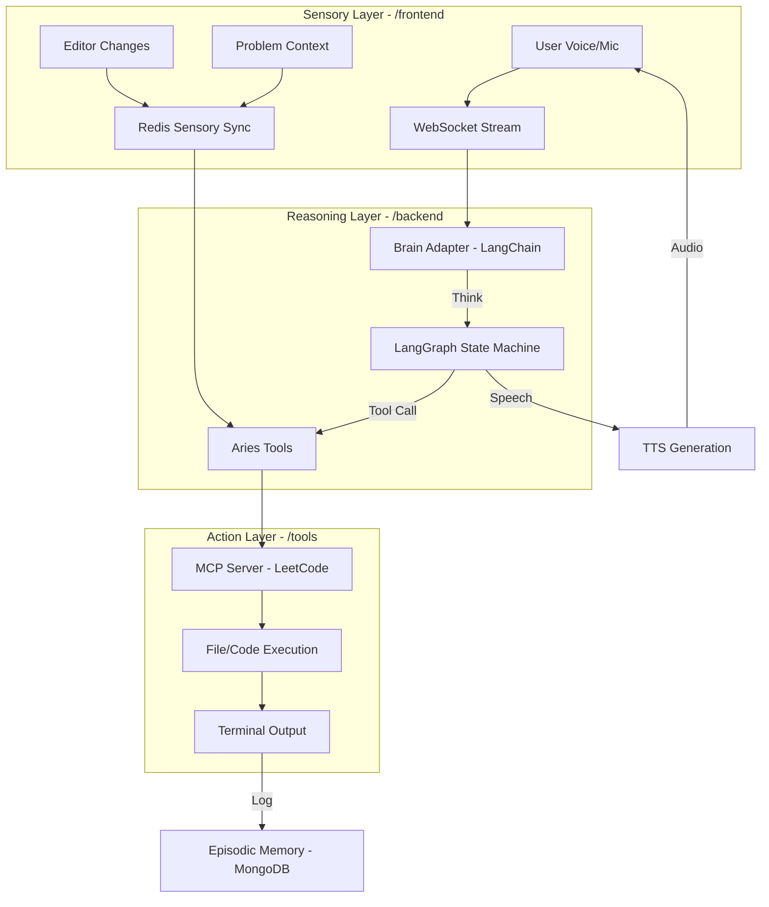

# DSA Agent - Root

Modern AI Coding Assistant for DSA Problems.

## System-Wide Flow (SRA Loop)

## Directory Structure
- `backend/`: FastAPI reasoning engine and memory adapters.
- `frontend/`: React sensory UI and voice capture.
- `tools/`: Automation scripts and prompt templates.
- `docs/`: ADRs, runbooks, and architecture specs.
- `.claude/`: Institutional memory and agent skills.

## Project Standards
Refer to [CLAUDE.md](file:///Users/shridharkulkarni/personal/learning-mcp/dsa-agent/CLAUDE.md) for detailed coding, styling, and documentation standards.
