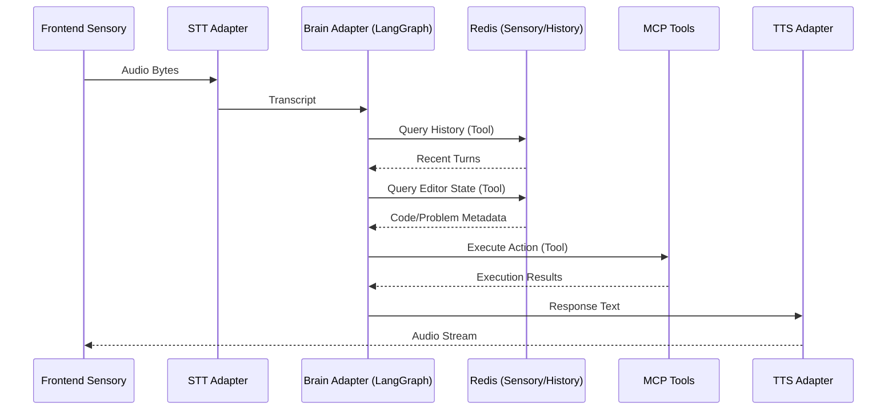

# Aries Backend - Reasoning Layer

The core intelligence behind the DSA Agent.

## Aries Brain Pipeline

## Standards
- **Formatter**: `black`
- **Import Sort**: `ruff`
- **Docstrings**: Google Style
- **Package Manager**: `uv`

## Core Modules
- `app/services/aries/pipeline`: The LangChain/LangGraph implementation.
- `app/infrastructure`: Database clients (Redis, Mongo, Chroma).
- `app/domain`: Core domain models and logic.
