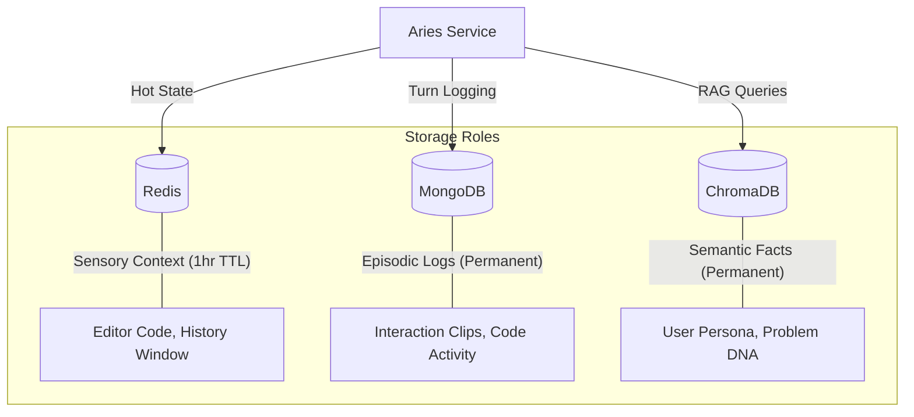

# Aries Infrastructure Layer

The `infrastructure` sub-package provides the foundational data access layers and adapter clients for various persistence and caching technologies.

## Multi-Tier Memory Interplay

Aries uses a tiered storage strategy to balance speed (Sensory), context (Short-term), and longevity (Episodic/Semantic).

## Core Adapters

- **[redis_client.py](file:///Users/shridharkulkarni/personal/learning-mcp/dsa-agent/backend/app/infrastructure/aries/redis_client.py)**: Async client for Redis. Handles state synchronization and rolling conversation history.
- **[mongo_client.py](file:///Users/shridharkulkarni/personal/learning-mcp/dsa-agent/backend/app/infrastructure/aries/mongo_client.py)**: Async client for MongoDB via Motor. Manages interaction episodes and historical code sessions.
- **[chroma_client.py](file:///Users/shridharkulkarni/personal/learning-mcp/dsa-agent/backend/app/infrastructure/aries/chroma_client.py)**: Manager for ChromaDB. Handles vectorization (via Ollama) and semantic similarity search.
