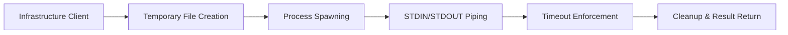

# Compiler Infrastructure: Low-Level Sandbox Execution

This layer handles the physical execution of Python code within isolated subprocesses.

## Execution Model

## Implementation Details

- **Process Isolation**: Uses `asyncio.create_subprocess_exec` to spawn fresh `python3` environments for every request.
- **Resource Management**: Implements `asyncio.wait_for` to ensure no script hangs indefinitely, preventing zombie processes and resource leaks.
- **Safety**: Code is never executed directly; it is written to a temporary `.py` file with a unique descriptor, executed, and then immediately deleted.
- **Imports**: Automatically injects a standard set of competitive programming libraries (`collections`, `heapq`, `bisect`, `math`) to provide a LeetCode-like experience.
