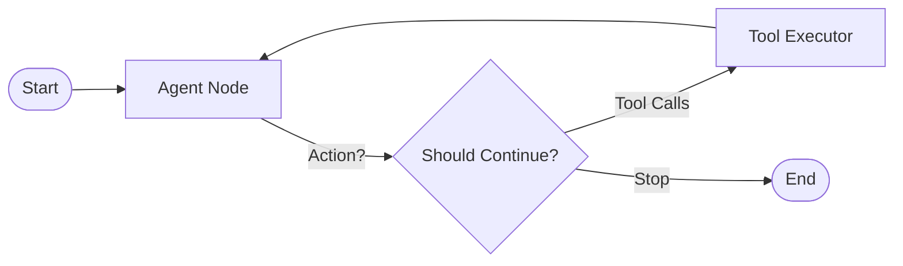

# Aries Perception & Reasoning Pipeline

The `pipeline` sub-package contains the specialized adapters and logic for the agent's sensory-motor capabilities and reasoning engine.

## Reasoning Architecture (LangGraph)

The core is a cyclic graph that routes between an AI 'thinking' node and a tool execution environment.

## Core Modules

- **[brain.py](file:///Users/shridharkulkarni/personal/learning-mcp/dsa-agent/backend/app/services/aries/pipeline/brain.py)**: The 'Pre-frontal Cortex'. Handles multi-provider LLM calls, embedding generation, and prompt normalization.
- **[graph.py](file:///Users/shridharkulkarni/personal/learning-mcp/dsa-agent/backend/app/services/aries/pipeline/graph.py)**: The 'Synaptic Map'. Defines the LangGraph structure, state schema, and routing logic.
- **[mcp_tools.py](file:///Users/shridharkulkarni/personal/learning-mcp/dsa-agent/backend/app/services/aries/pipeline/mcp_tools.py)**: The 'Extended Tools'. Dynamically discovers and binds Model Context Protocol (MCP) tools to the agent.
- **[stt.py](file:///Users/shridharkulkarni/personal/learning-mcp/dsa-agent/backend/app/services/aries/pipeline/stt.py)** & **[tts.py](file:///Users/shridharkulkarni/personal/learning-mcp/dsa-agent/backend/app/services/aries/pipeline/tts.py)**: The 'Senses' and 'Larynx'. Interfaces with Deepgram for audio-to-text and text-to-audio.
- **[history.py](file:///Users/shridharkulkarni/personal/learning-mcp/dsa-agent/backend/app/services/aries/pipeline/history.py)**: The 'Short-term Buffer'. Manages rolling conversation history for session continuity.
