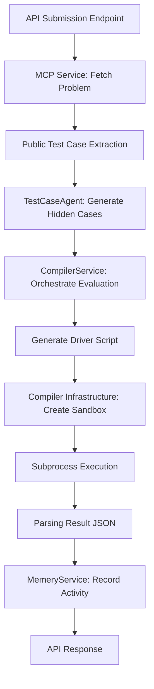

# Compiler Service: Code Execution & Sandbox Orchestration

This service manages the high-level orchestration of Python code execution and sandbox evaluation for DSA problem solving.

## Architectural Flow

The following flowchart describes the lifecycle of a solution submission, from problem discovery to test evaluation.

## Key Components

- **`CompilerService`**: The primary domain service that generates driver scripts to introspect user `Solution` classes and run massive test suites in a single sandbox pass.
- **`TestCaseAgent`**: An agentic component that uses LLMs to analyze problem constraints and generate tricky edge cases (hidden test cases).
- **`service.py`**: Contains the logic for driver script templating, including complex object serialization and order-independent comparison.

## Sandbox Security & Design

- **Subprocess Isolation**: Code is executed in a separate `python3` process with restricted standard input.
- **Timeouts**: Execution is bounded by strict timeouts (5s for raw code, 10s for driver scripts) to prevent resource exhaustion.
- **Transience**: Every execution creates a unique temporary file that is immediately cleaned up upon completion or failure.
