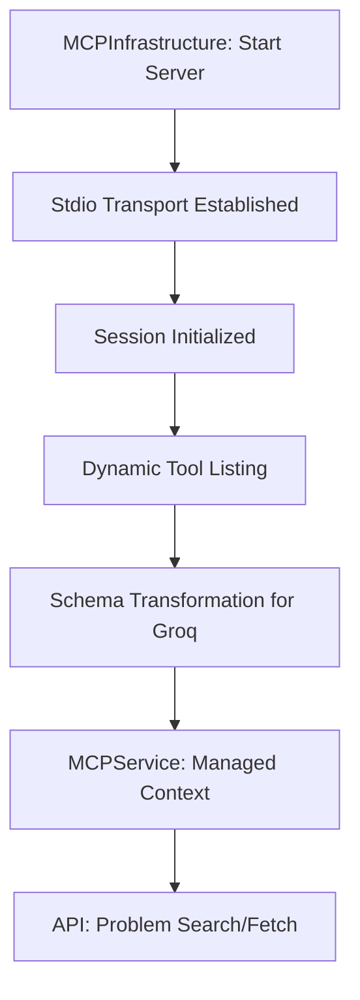

# MCP Slice: Platform Integration & Tool Orchestration

This slice manages the integration with the LeetCode Model Context Protocol (MCP) server, enabling dynamic problem discovery and metadata retrieval.

## Tool Discovery Lifecycle

## Key Components

- **`MCPInfrastructure`**: Handles the low-level `npx` execution of the `@jinzcdev/leetcode-mcp-server`. It manages stdio pipes and session lifecycles.
- **`MCPService`**: A high-level domain service that provides a clean interface for calling discovered tools like `get_problem` and `search_problems`.
- **API Cache**: The router maintains an in-memory cache for daily challenges and problem summaries to minimize MCP server cold-starts.

## Unified Memory Integration

- **Event Logging**: Every problem load (`LOAD_PROBLEM`) and search (`SEARCH_PROBLEMS`) is logged to the Aries memory palace.
- **Hot Context**: Loaded problem metadata is immediately cached in Redis for fast state-aware reasoning by the Aries voice agent.
- **Semantic Archival**: HTML content is asynchronously summarized and stored in ChromaDB for long-term RAG (Retrieval-Augmented Generation).
