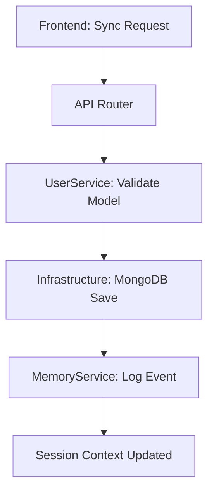

# User Service: Profile & Performance Management

This service manages the lifecycle of user identities and their performance metrics across the platform.

## Profile Lifecycle

## Key Components

- **`UserProfile`**: The central domain model for identity, including ranking, avatar URLs, and synchronization timestamps.
- **`UserService`**: Orchestrates the bridge between the Pydantic models and the MongoDB infrastructure clients.
- **Unified Memory Integration**: Every profile sync is logged as an event in Redis, allowing Aries to maintain a coherent understanding of the user's progress across sessions.

## Persistence Policy

- **Atomic Saves**: Profile updates are atomic via the `aries_mongo.save_user_profile` operation.
- **Modern Pydantic**: Leverages Pydantic v2 `model_dump()` for clean serialization into BSON-compatible dictionaries.
