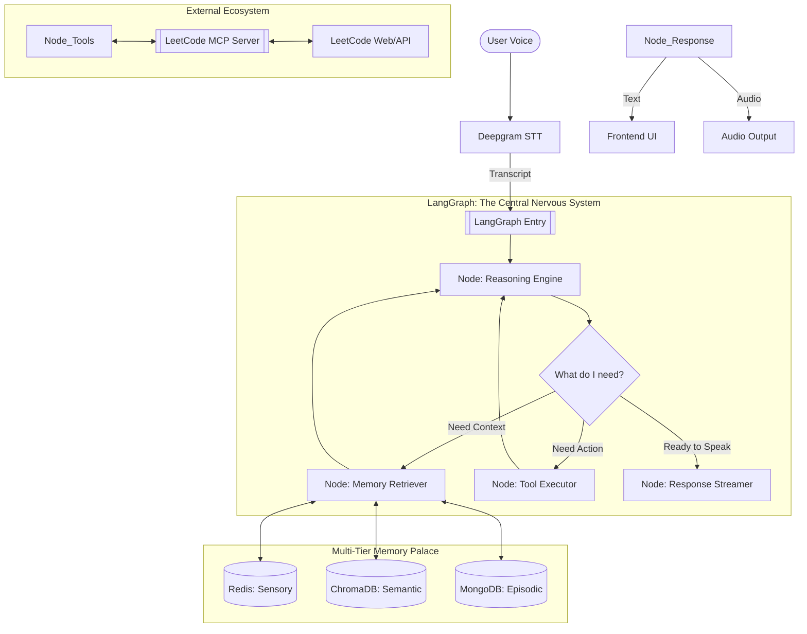

# Aries Brain Architecture: LangChain + LangGraph + Memory Palace

This document visualizes the "Nervous System" of the new Aries. It shows how information flows from your voice, through the tiered memory layers, into the LangGraph state machine, and finally out as actions and speech.

## 🗺️ The Master Flowchart

## 🗄️ Database Roles: The Three Pillars of Memory

| Database | Layer | Role | Latency | Data Type |
| :--- | :--- | :--- | :--- | :--- |
| **Redis** | **Sensory** | Currently open code, active problem slug, transient session flags. | 🔥 <1ms | Key-Value / JSON |
| **ChromaDB** | **Semantic** | **Memory Palace**: User facts, problem summaries, technical concepts (indexed via embeddings). | ⚡ <20ms | Vectors + Metadata |
| **MongoDB** | **Episodic** | Historical logs of every conversation "episode" for long-term audit and retraining. | 🧊 <100ms | BSON Documents |

## 🛠️ The Action Loop: Connecting to MCPs

When Aries "thinks" of an action (e.g., `[RUN_CODE]`), the following happens:

1.  **Tool Routing**: LangGraph detects a specific tool call in the LLM's output.
2.  **MCP Handshake**: The `Tool Executor` node uses the `MCPClient` to call the LeetCode MCP server.
3.  **Real-world Execution**: The MCP server interacts with LeetCode (running your code or fetching a problem).
4.  **Observation**: The result (e.g., "Tests Passed") is fed back into the **LangGraph State**.
5.  **Final Response**: Aries looks at the test results and speaks to you: *"Great job! Your solution passed all test cases..."*

## 🎭 The User Interaction

The entire loop is designed to be **cyclic**. Unlike a standard chatbot, Aries stays in the `Listening` state after an action, waiting for your next instruction while maintaining a perfect "State" of the code and your previous progress.
